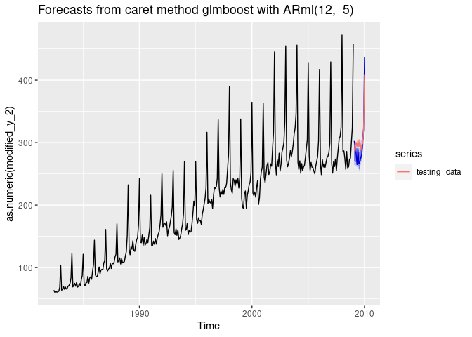
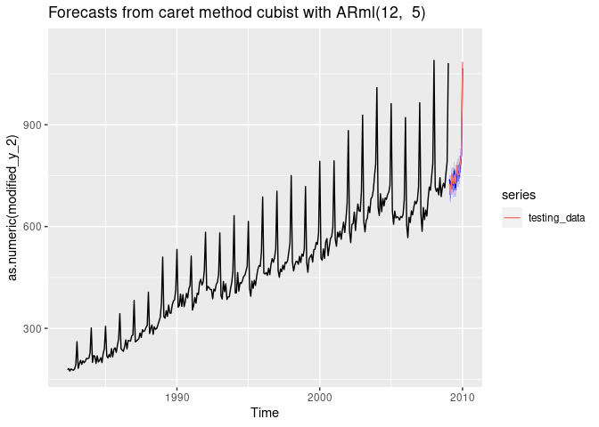
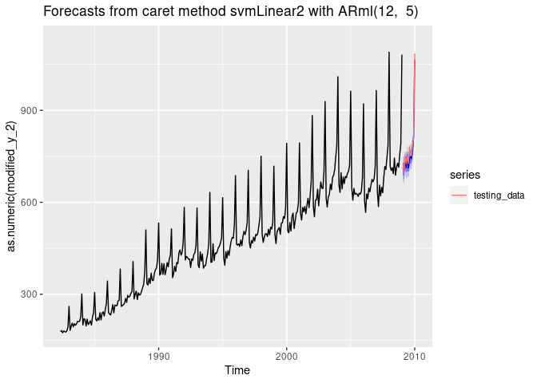
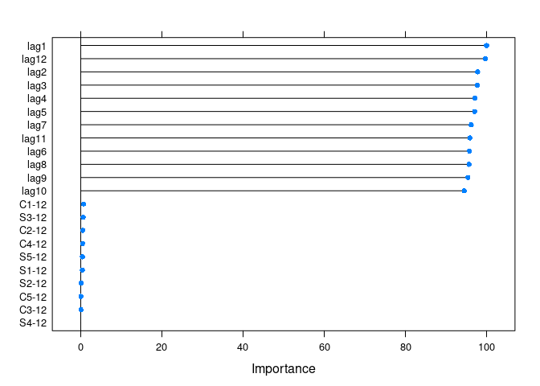
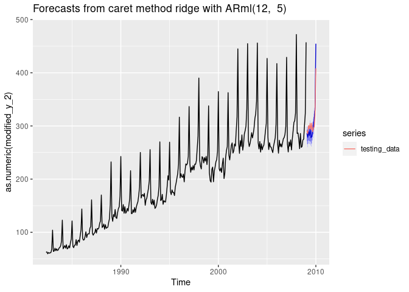
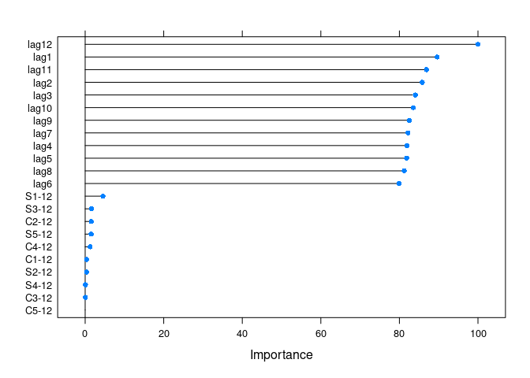

<!-- README.md is generated from README.Rmd. Please edit that file -->

# caretForecast

<!-- badges: start -->

[](https://codecov.io/gh/Akai01/caretForecast)
[](https://CRAN.R-project.org/package=caretForecast)
[](https://www.tidyverse.org/lifecycle/#experimental)
<!-- badges: end -->

The goal of caretForecast is to provide tools for forecasting time
series data using various machine learning algorithms. (More details
will follow…)

## Installation

The development version from [GitHub](https://github.com/) with:

``` r
# install.packages("devtools")
devtools::install_github("Akai01/caretForecast")
```

## Example

### Note: User can train any caret supported regression model.

These are basic examples which shows you how to solve common problems
with different ML models.

``` r
library(caretForecast)
#> Registered S3 method overwritten by 'quantmod':
#>   method            from
#>   as.zoo.data.frame zoo
# Forecasting Retail Data with glmboost
data(retail_wide, package = "caretForecast")

i <- 8

dtlist <- caretForecast::split_ts(retail_wide[,i], test_size = 12)

training_data <- dtlist$train

testing_data <- dtlist$test

fit <- ARml(training_data, max_lag = 12, caret_method = "glmboost", 
            verbose = FALSE)
#> Loading required package: lattice
#> Loading required package: ggplot2
forecast(fit, h = length(testing_data), level = c(80,95), PI = TRUE)-> fc

accuracy(fc, testing_data)
#>                     ME     RMSE      MAE        MPE     MAPE      MASE
#> Training set 0.8868074 16.39661 11.65025 -0.3620986 5.702257 0.7559694
#> Test set     8.3976171 20.15546 17.20306  3.0153042 5.572722 1.1162843
#>                   ACF1 Theil's U
#> Training set 0.5707204        NA
#> Test set     0.3971016 0.7547318
autoplot(fc) + 
  autolayer(testing_data, series = "testing_data")
```



``` r
## NOTE : Promotions, holidays, and other external variables can be added in the model via xreg argument. Please look at the documentation of ARml.

# Forecasting Retail Data with cubist regression

i <- 9

data(retail_wide, package = "caretForecast")

dtlist <- caretForecast::split_ts(retail_wide[,i], test_size = 12)

training_data <- dtlist$train

testing_data <- dtlist$test

fit <- ARml(training_data, max_lag = 12, caret_method = "cubist", 
            verbose = FALSE)

forecast(fit, h = length(testing_data), level = c(80,95), PI = TRUE)-> fc

accuracy(fc, testing_data)
#>                     ME     RMSE      MAE         MPE     MAPE      MASE
#> Training set 0.3452345 16.39877 12.22406 -0.08475644 2.533889 0.4073634
#> Test set     2.5562312 14.21461 12.39887  0.24907619 1.592606 0.4131888
#>                    ACF1 Theil's U
#> Training set  0.2309758        NA
#> Test set     -0.1450719 0.1701567
autoplot(fc) + 
  autolayer(testing_data, series = "testing_data")
```



``` r
# Forecasting using Support Vector Machines with Linear Kernel

data(retail_wide, package = "caretForecast")

i <- 7

dtlist <- caretForecast::split_ts(retail_wide[,i], test_size = 12)

training_data <- dtlist$train

testing_data <- dtlist$test

fit <- ARml(training_data, max_lag = 12, caret_method = "svmLinear2", 
            verbose = FALSE)

forecast(fit, h = length(testing_data), level = c(80,95), PI = TRUE)-> fc

accuracy(fc, testing_data)
#>                      ME      RMSE       MAE        MPE     MAPE      MASE
#> Training set  0.3016388  6.933042  4.969558 -0.1057475 3.724202 0.3209987
#> Test set     16.6048808 20.812588 16.846600  5.7734741 5.875854 1.0881725
#>                    ACF1 Theil's U
#> Training set 0.06480896        NA
#> Test set     0.33020419  0.884742
autoplot(fc) + 
  autolayer(testing_data, series = "testing_data")
```



``` r
get_var_imp(fc)
```



``` r
get_var_imp(fc, plot = F)
#> loess r-squared variable importance
#> 
#>   only 20 most important variables shown (out of 22)
#> 
#>         Overall
#> lag1  100.00000
#> lag12  99.74827
#> lag2   97.78807
#> lag3   97.74610
#> lag4   97.10962
#> lag5   97.08285
#> lag7   96.20291
#> lag11  95.90430
#> lag6   95.80115
#> lag8   95.68963
#> lag9   95.38585
#> lag10  94.50733
#> C1-12   0.68853
#> S3-12   0.60001
#> C2-12   0.50234
#> C4-12   0.44290
#> S5-12   0.41720
#> S1-12   0.40638
#> S2-12   0.09599
#> C5-12   0.05234
# Forecasting using Ridge Regression
data(retail_wide, package = "caretForecast")

i <- 8

dtlist <- caretForecast::split_ts(retail_wide[,i], test_size = 12)

training_data <- dtlist$train

testing_data <- dtlist$test

fit <- ARml(training_data, max_lag = 12, caret_method = "ridge", 
            verbose = FALSE)

forecast(fit, h = length(testing_data), level = c(80,95), PI = TRUE)-> fc

accuracy(fc, testing_data)
#>                     ME     RMSE      MAE        MPE     MAPE      MASE
#> Training set 0.1414756  8.88367  6.44208 -0.0953757 3.126316 0.4180182
#> Test set     0.9965672 17.71459 13.30744  0.7019753 4.092068 0.8635023
#>                     ACF1 Theil's U
#> Training set 0.004518837        NA
#> Test set     0.389409945 0.6513039
autoplot(fc) + 
  autolayer(testing_data, series = "testing_data")
```



``` r
get_var_imp(fc)
```



``` r
get_var_imp(fc, plot = F)
#> loess r-squared variable importance
#> 
#>   only 20 most important variables shown (out of 22)
#> 
#>         Overall
#> lag12 100.00000
#> lag1   89.57697
#> lag11  86.89260
#> lag2   85.81967
#> lag3   84.07269
#> lag10  83.53358
#> lag9   82.52774
#> lag7   82.18917
#> lag4   81.93730
#> lag5   81.85290
#> lag8   81.22696
#> lag6   79.96364
#> S1-12   4.51371
#> S3-12   1.59063
#> C2-12   1.54661
#> S5-12   1.53004
#> C4-12   1.24044
#> C1-12   0.38784
#> S2-12   0.35446
#> S4-12   0.07244
```
