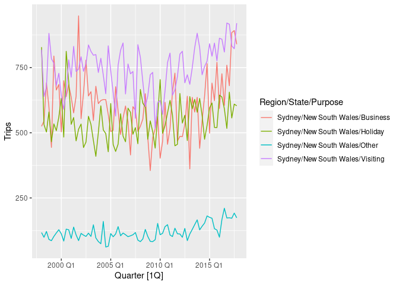
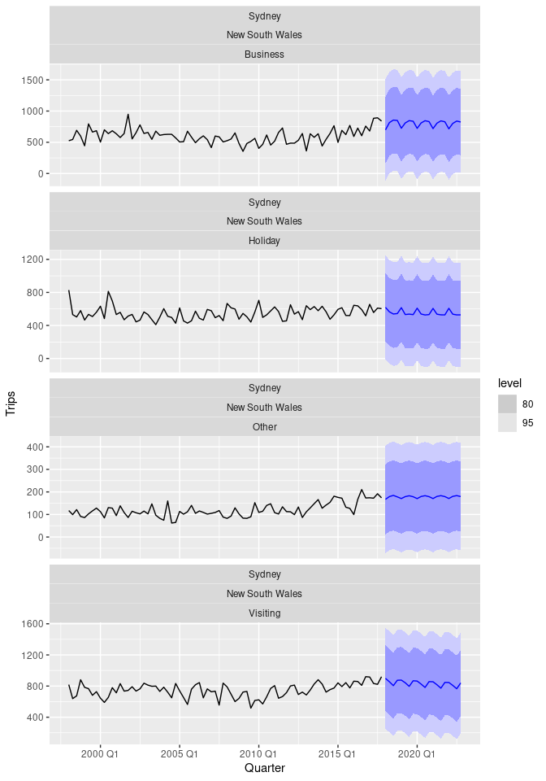

<!-- README.md is generated from README.Rmd. Please edit that file -->

# caretForecast

<!-- badges: start -->
<!-- badges: end -->

The goal of caretForecast is to provide tools for forecasting time
series data using various machine learning algorithms.

## Installation

The CRAN version with:

``` r
install.packages("caretForecast")
```

The development version from [GitHub](https://github.com/) with:

``` r
# install.packages("devtools")
devtools::install_github("Akai01/caretForecast")
```

# Examples

These are basic examples which shows you how to solve common problems
with different ML models.

## Examples of tidy forecasting via formula interface:

Load the packages:

``` r
library(caretForecast)
library(tsibble)
library(dplyr)
```

``` r
tourism_syd <- tourism %>%
  filter(Region == "Sydney")

tourism_syd %>%
  group_by(Purpose) %>%
  slice(1)
#> # A tsibble: 4 x 5 [1Q]
#> # Key:       Region, State, Purpose [4]
#> # Groups:    Purpose [4]
#>   Quarter Region State           Purpose  Trips
#>     <qtr> <chr>  <chr>           <chr>    <dbl>
#> 1 1998 Q1 Sydney New South Wales Business  525.
#> 2 1998 Q1 Sydney New South Wales Holiday   828.
#> 3 1998 Q1 Sydney New South Wales Other     117.
#> 4 1998 Q1 Sydney New South Wales Visiting  818.
```

``` r
tourism_syd %>%
  autoplot(Trips)
```



``` r
fit <- tourism_syd %>%
  model(
    caret = CARET(Trips ~ fourier(K = 2) + order(8) , caret_method = "lasso", verbose = FALSE)
  )
fit
#> # A mable: 4 x 4
#> # Key:     Region, State, Purpose [4]
#>   Region State           Purpose    caret
#>   <chr>  <chr>           <chr>    <model>
#> 1 Sydney New South Wales Business <CARET>
#> 2 Sydney New South Wales Holiday  <CARET>
#> 3 Sydney New South Wales Other    <CARET>
#> 4 Sydney New South Wales Visiting <CARET>
```

``` r
fc <- fit %>%
  forecast(h = "5 years")
fc
#> # A fable: 80 x 7 [1Q]
#> # Key:     Region, State, Purpose, .model [4]
#>    Region State           Purpose  .model Quarter          Trips .mean
#>    <chr>  <chr>           <chr>    <chr>    <qtr>         <dist> <dbl>
#>  1 Sydney New South Wales Business caret  2018 Q1 N(699, 172029)  699.
#>  2 Sydney New South Wales Business caret  2018 Q2 N(815, 172029)  815.
#>  3 Sydney New South Wales Business caret  2018 Q3 N(855, 172029)  855.
#>  4 Sydney New South Wales Business caret  2018 Q4 N(849, 172029)  849.
#>  5 Sydney New South Wales Business caret  2019 Q1 N(725, 172029)  725.
#>  6 Sydney New South Wales Business caret  2019 Q2 N(809, 172029)  809.
#>  7 Sydney New South Wales Business caret  2019 Q3 N(846, 172029)  846.
#>  8 Sydney New South Wales Business caret  2019 Q4 N(837, 172029)  837.
#>  9 Sydney New South Wales Business caret  2020 Q1 N(723, 172029)  723.
#> 10 Sydney New South Wales Business caret  2020 Q2 N(809, 172029)  809.
#> # … with 70 more rows
```

``` r
fc %>%
  hilo(level = c(80, 95))
#> # A tsibble: 80 x 9 [1Q]
#> # Key:       Region, State, Purpose, .model [4]
#>    Region State           Purpose  .model Quarter          Trips .mean
#>    <chr>  <chr>           <chr>    <chr>    <qtr>         <dist> <dbl>
#>  1 Sydney New South Wales Business caret  2018 Q1 N(699, 172029)  699.
#>  2 Sydney New South Wales Business caret  2018 Q2 N(815, 172029)  815.
#>  3 Sydney New South Wales Business caret  2018 Q3 N(855, 172029)  855.
#>  4 Sydney New South Wales Business caret  2018 Q4 N(849, 172029)  849.
#>  5 Sydney New South Wales Business caret  2019 Q1 N(725, 172029)  725.
#>  6 Sydney New South Wales Business caret  2019 Q2 N(809, 172029)  809.
#>  7 Sydney New South Wales Business caret  2019 Q3 N(846, 172029)  846.
#>  8 Sydney New South Wales Business caret  2019 Q4 N(837, 172029)  837.
#>  9 Sydney New South Wales Business caret  2020 Q1 N(723, 172029)  723.
#> 10 Sydney New South Wales Business caret  2020 Q2 N(809, 172029)  809.
#> # … with 70 more rows, and 2 more variables: `80%` <hilo>, `95%` <hilo>
```

``` r
fc %>%
  autoplot(tourism_syd)
```



## Examples with `ts` objects:

### Note: User can train any caret supported regression model.

``` r
library(caretForecast)

# Forecasting with glmboost
data(retail_wide, package = "caretForecast")

i <- 8

dtlist <- caretForecast::split_ts(retail_wide[,i], test_size = 12)

training_data <- dtlist$train

testing_data <- dtlist$test

fit <- ARml(training_data, max_lag = 12, caret_method = "glmboost", 
            verbose = FALSE)
#> Registered S3 method overwritten by 'inum':
#>   method          from   
#>   format.interval tsibble

forecast(fit, h = length(testing_data), level = c(80,95), PI = TRUE)-> fc

accuracy(fc, testing_data)
#>                     ME     RMSE      MAE        MPE     MAPE      MASE
#> Training set 0.8868074 16.39661 11.65025 -0.3620986 5.702257 0.7559694
#> Test set     8.3976171 20.15546 17.20306  3.0153042 5.572722 1.1162843
#>                   ACF1 Theil's U
#> Training set 0.5707204        NA
#> Test set     0.3971016 0.7547318


autoplot(fc) + 
  autolayer(testing_data, series = "testing_data")
```


``` r


## NOTE : Promotions, holidays, and other external variables can be added in the model via xreg argument. Please look at the documentation of ARml.

# Forecasting with cubist regression

i <- 9

data(retail_wide, package = "caretForecast")

dtlist <- caretForecast::split_ts(retail_wide[,i], test_size = 12)

training_data <- dtlist$train

testing_data <- dtlist$test

fit <- ARml(training_data, max_lag = 12, caret_method = "cubist", 
            verbose = FALSE)

forecast(fit, h = length(testing_data), level = c(80,95), PI = TRUE)-> fc

accuracy(fc, testing_data)
#>                     ME     RMSE      MAE         MPE     MAPE      MASE
#> Training set 0.3452345 16.39877 12.22406 -0.08475644 2.533889 0.4073634
#> Test set     2.5562312 14.21461 12.39887  0.24907619 1.592606 0.4131888
#>                    ACF1 Theil's U
#> Training set  0.2309758        NA
#> Test set     -0.1450719 0.1701567

autoplot(fc) + 
  autolayer(testing_data, series = "testing_data")
```


``` r


# Forecasting using Support Vector Machines with Linear Kernel

data(retail_wide, package = "caretForecast")

i <- 9

dtlist <- caretForecast::split_ts(retail_wide[,i], test_size = 12)

training_data <- dtlist$train

testing_data <- dtlist$test

fit <- ARml(training_data, max_lag = 12, caret_method = "svmLinear2", 
            verbose = FALSE, pre_process = c("scale", "center"))

forecast(fit, h = length(testing_data), level = c(80,95), PI = TRUE)-> fc

accuracy(fc, testing_data)
#>                      ME     RMSE      MAE        MPE     MAPE      MASE
#> Training set  0.9564442 14.96132 11.49181 0.03448939 2.389909 0.3829612
#> Test set     11.5443091 17.28817 12.13599 1.45002115 1.528606 0.4044282
#>                    ACF1 Theil's U
#> Training set  0.1186887        NA
#> Test set     -0.1205859 0.2162142

autoplot(fc) + 
  autolayer(testing_data, series = "testing_data")
```


``` r
get_var_imp(fc)
```


``` r
get_var_imp(fc, plot = F)
#> loess r-squared variable importance
#> 
#>   only 20 most important variables shown (out of 23)
#> 
#>        Overall
#> lag12 100.0000
#> lag1   89.7081
#> lag11  88.2143
#> lag2   87.1590
#> lag3   86.9504
#> lag9   86.2254
#> lag5   85.9874
#> lag7   85.8639
#> lag10  85.5641
#> lag4   85.4456
#> lag8   84.9521
#> lag6   83.6642
#> S1-12   2.6289
#> S3-12   1.3820
#> S5-12   1.3283
#> C2-12   1.2131
#> C4-12   1.0998
#> C1-12   0.4468
#> S2-12   0.1472
#> C6-12   0.1301


# Forecasting using Ridge Regression
data(retail_wide, package = "caretForecast")

i <- 8

dtlist <- caretForecast::split_ts(retail_wide[,i], test_size = 12)

training_data <- dtlist$train

testing_data <- dtlist$test

fit <- ARml(training_data, max_lag = 12, caret_method = "ridge", 
            verbose = FALSE)

forecast(fit, h = length(testing_data), level = c(80,95), PI = TRUE)-> fc

accuracy(fc, testing_data)
#>                     ME      RMSE      MAE         MPE     MAPE      MASE
#> Training set 0.1284069  8.284316  6.00773 -0.08485635 2.948404 0.3898338
#> Test set     1.0161542 17.826752 13.38819  0.71591188 4.119535 0.8687421
#>                    ACF1 Theil's U
#> Training set 0.01202197        NA
#> Test set     0.44042369 0.6568084

autoplot(fc) + 
  autolayer(testing_data, series = "testing_data")
```


``` r
get_var_imp(fc)
```


``` r
get_var_imp(fc, plot = F)
#> loess r-squared variable importance
#> 
#>   only 20 most important variables shown (out of 23)
#> 
#>        Overall
#> lag12 100.0000
#> lag1   89.5770
#> lag11  86.8926
#> lag2   85.8197
#> lag3   84.0727
#> lag10  83.5336
#> lag9   82.5277
#> lag7   82.1892
#> lag4   81.9373
#> lag5   81.8529
#> lag8   81.2270
#> lag6   79.9636
#> S1-12   4.5137
#> S3-12   1.5906
#> C2-12   1.5466
#> S5-12   1.5300
#> C4-12   1.2404
#> C1-12   0.3878
#> S2-12   0.3545
#> C6-12   0.2761
```
