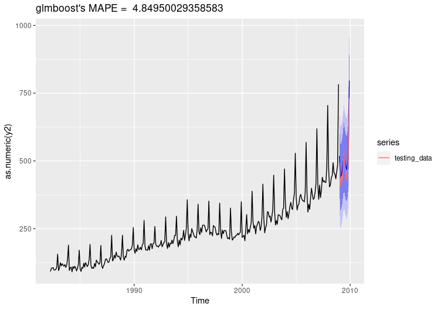
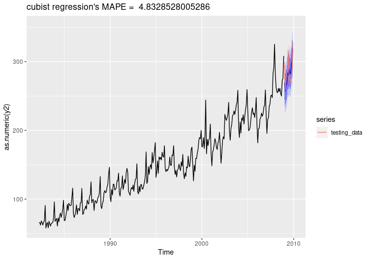
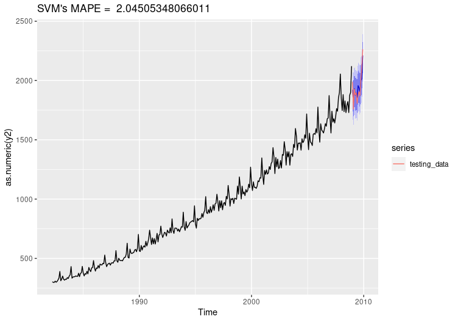
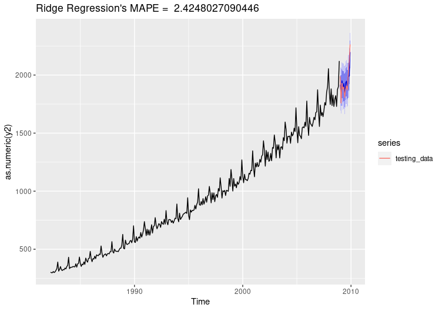

# caretForecast Package: Installation and basic usage

 <!-- badges: start -->
  [](https://travis-ci.com/Akai01/caretForecast) [](https://codecov.io/gh/Akai01/caretForecast)
  <!-- badges: end -->


### Installation


```r


devtools::install_github("Akai01/caretForecast")

```


## Examples

###  Note: User can train any caret supported regression model.

#### ----------------- Forecasting Retail Data with glmboost -------------------
```r
library(caretForecast)
library(forecast)

retail <- read.csv("https://robjhyndman.com/data/ausretail.csv",header=FALSE)

retail <- ts(retail[,-1],f=12,s=1982+3/12)

training_data <- window(retail, end = c(2008, 12))

testing_data <- window(retail, start = c(2009, 1))

i <- 6

fit <- ARml(training_data[,i], max_lag = 12, caret_method = "glmboost")

forecast(fit, h = nrow(testing_data), level = c(95,80))-> fc

accuracy(fc, testing_data[,i])

MAPE <- accuracy(fc, testing_data[,i])[,"MAPE"][2]

fc_plot(fc, main = paste("glmboost's MAPE = ", MAPE)) + 
autolayer(testing_data[,i], series = "testing_data")

get_var_imp(fc)
get_var_imp(fc, plot = F)
```



## NOTE : Promotions, holidays, and other external variables can be added in the model via xreg argument. Please look at the documentation of ARml.


#### ----------------- Forecasting Retail Data with cubist -------------------
```r
library(caretForecast)
library(forecast)

retail <- read.csv("https://robjhyndman.com/data/ausretail.csv",header=FALSE)

retail <- ts(retail[,-1],f=12,s=1982+3/12)

training_data <- window(retail, end = c(2008, 12))

testing_data <- window(retail, start = c(2009, 1))

i <- 5

fit <- ARml(training_data[,i], max_lag = 12, caret_method = "cubist")

forecast(fit, h = nrow(testing_data), level = c(95,80))-> fc

accuracy(fc, testing_data[,i])

MAPE <- accuracy(fc, testing_data[,i])[,"MAPE"][2]

fc_plot(fc, main = paste("cubist regression's MAPE = ", MAPE)) + 
autolayer(testing_data[,i], series = "testing_data")

get_var_imp(fc)

get_var_imp(fc, plot = F)

```



#### ---------Forecasting Retail Data with Support Vector Machines with Linear Kernel -------------
```r
library(caretForecast)
library(forecast)

retail <- read.csv("https://robjhyndman.com/data/ausretail.csv",header=FALSE)

retail <- ts(retail[,-1],f=12,s=1982+3/12)

training_data <- window(retail, end = c(2008, 12))

testing_data <- window(retail, start = c(2009, 1))

i <- 1

fit <- ARml(training_data[,i], max_lag = 12, caret_method = "svmLinear")

forecast(fit, h = nrow(testing_data), level = c(95,80))-> fc

accuracy(fc, testing_data[,i])

MAPE <- accuracy(fc, testing_data[,i])[,"MAPE"][2]

fc_plot(fc, main = paste("SVM's MAPE = ", MAPE)) + 
autolayer(testing_data[,i], series = "testing_data")

get_var_imp(fc)

get_var_imp(fc, plot = F)

```


#### ---------Forecasting Retail Data with Ridge Regression -------------
```r
library(caretForecast)
library(forecast)

retail <- read.csv("https://robjhyndman.com/data/ausretail.csv",header=FALSE)

retail <- ts(retail[,-1],f=12,s=1982+3/12)

training_data <- window(retail, end = c(2008, 12))

testing_data <- window(retail, start = c(2009, 1))

i <- 1

fit <- ARml(training_data[,i], max_lag = 12, caret_method = "ridge")

forecast(fit, h = nrow(testing_data), level = c(95,80))-> fc

accuracy(fc, testing_data[,i])

MAPE <- accuracy(fc, testing_data[,i])[,"MAPE"][2]

fc_plot(fc, main = paste("Ridge Regression's MAPE = ", MAPE)) + 
autolayer(testing_data[,i], series = "testing_data")

get_var_imp(fc)

get_var_imp(fc, plot = F)

```


