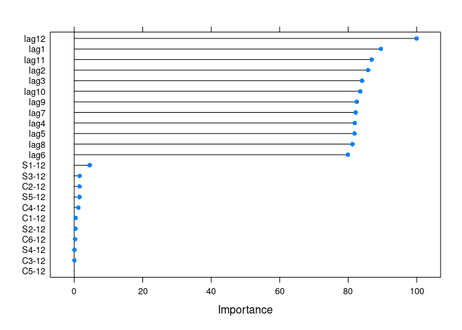

<!-- README.md is generated from README.Rmd. Please edit that file -->

# caretForecast

<!-- badges: start -->

[](https://travis-ci.com/Akai01/caretForecast)
[](https://codecov.io/gh/Akai01/caretForecast)
[](https://CRAN.R-project.org/package=caretForecast)
[](https://www.tidyverse.org/lifecycle/#maturing)
<!-- badges: end -->

The goal of caretForecast is to provide tools for forecasting time
series data using various machine learning algorithms. (More details
will follow…)

## Installation

The development version from [GitHub](https://github.com/) with:

``` r
# install.packages("devtools")
devtools::install_github("Akai01/caretForecast")
```

## Example

### Note: User can train any caret supported regression model.

These are basic examples which shows you how to solve common problems
with different ML models.

``` r

library(caretForecast)
#> Registered S3 method overwritten by 'quantmod':
#>   method            from
#>   as.zoo.data.frame zoo
library(forecast)

# Forecasting Retail Data with glmboost
data(retail_wide, package = "caretForecast")

i <- 8

dtlist <- caretForecast::split_ts(retail_wide[,i], test_size = 12)

training_data <- dtlist$train

testing_data <- dtlist$test

fit <- ARml(training_data, max_lag = 12, caret_method = "glmboost", 
            verbose = FALSE)
#> Loading required package: lattice
#> Loading required package: ggplot2

forecast(fit, h = length(testing_data), level = c(95,80))-> fc

accuracy(fc, testing_data)
#>                    ME     RMSE       MAE       MPE     MAPE      MASE      ACF1
#> Training set 0.607478 10.21615  7.290324 -0.203876 5.192473 0.4709039 0.4751444
#> Test set     4.871290 14.70340 10.858000  1.314927 3.769520 0.7013508 0.3969524
#>              Theil's U
#> Training set        NA
#> Test set     0.6046472


fc_plot(fc) + 
autolayer(testing_data, series = "testing_data")
```


``` r


## NOTE : Promotions, holidays, and other external variables can be added in the model via xreg argument. Please look at the documentation of ARml.

# Forecasting Retail Data with cubist regression

i <- 9

data(retail_wide, package = "caretForecast")

dtlist <- caretForecast::split_ts(retail_wide[,i], test_size = 12)

training_data <- dtlist$train

testing_data <- dtlist$test

fit <- ARml(training_data, max_lag = 12, caret_method = "cubist", 
            verbose = FALSE)

forecast(fit, h = length(testing_data), level = c(95,80))-> fc

accuracy(fc, testing_data)
#>                      ME      RMSE      MAE         MPE     MAPE      MASE
#> Training set  0.3297442  8.998975 6.453195 -0.03980343 3.132082 0.4187394
#> Test set     -3.1496258 14.421058 9.957933 -0.76868573 3.035664 0.6461573
#>                   ACF1 Theil's U
#> Training set 0.1062483        NA
#> Test set     0.2273518 0.5300733

fc_plot(fc) + 
autolayer(testing_data, series = "testing_data")
```


``` r


# Forecasting using Support Vector Machines with Linear Kernel

data(retail_wide, package = "caretForecast")

i <- 5

dtlist <- caretForecast::split_ts(retail_wide[,i], test_size = 12)

training_data <- dtlist$train

testing_data <- dtlist$test

fit <- ARml(training_data, max_lag = 12, caret_method = "svmLinear", 
            verbose = FALSE)

forecast(fit, h = length(testing_data), level = c(95,80))-> fc

accuracy(fc, testing_data)
#>                      ME     RMSE      MAE        MPE     MAPE      MASE
#> Training set 0.08139721 17.53112 13.62193 -0.2546303 4.112980 0.7153960
#> Test set     3.44175464 20.51069 15.60614  0.7824485 3.125285 0.8196031
#>                     ACF1 Theil's U
#> Training set  0.01627236        NA
#> Test set     -0.18179943 0.1854082

fc_plot(fc) + 
autolayer(testing_data, series = "testing_data")
```


``` r

get_var_imp(fc)
```


``` r

get_var_imp(fc, plot = F)
#> loess r-squared variable importance
#> 
#>   only 20 most important variables shown (out of 22)
#> 
#>        Overall
#> lag12 100.0000
#> lag1   49.4817
#> lag7   43.7834
#> lag11  40.7832
#> lag6   40.7463
#> lag5   40.0977
#> lag2   38.5547
#> lag8   32.1267
#> lag3   30.2872
#> lag4   28.9004
#> lag9   24.5431
#> lag10  20.1536
#> C2-12  14.0799
#> S3-12   8.9038
#> S1-12   7.5752
#> C4-12   6.8879
#> S5-12   5.8994
#> S2-12   3.7769
#> C1-12   1.5751
#> C3-12   0.3495


# Forecasting using Ridge Regression
data(retail_wide, package = "caretForecast")

i <- 8

dtlist <- caretForecast::split_ts(retail_wide[,i], test_size = 12)

training_data <- dtlist$train

testing_data <- dtlist$test

fit <- ARml(training_data, max_lag = 12, caret_method = "ridge", 
            verbose = FALSE)

forecast(fit, h = length(testing_data), level = c(95,80))-> fc

accuracy(fc, testing_data)
#>                      ME     RMSE       MAE       MPE     MAPE      MASE
#> Training set  0.1610492  6.82989  4.878706 -0.112876 3.673076 0.3151303
#> Test set     14.3399436 18.17074 14.659070  5.000961 5.136127 0.9468733
#>                    ACF1 Theil's U
#> Training set 0.01354464        NA
#> Test set     0.25207860 0.7777944

fc_plot(fc) + 
autolayer(testing_data, series = "testing_data")
```


``` r

get_var_imp(fc)
```



``` r

get_var_imp(fc, plot = F)
#> loess r-squared variable importance
#> 
#>   only 20 most important variables shown (out of 22)
#> 
#>         Overall
#> lag1  100.00000
#> lag12  99.74827
#> lag2   97.78807
#> lag3   97.74610
#> lag4   97.10962
#> lag5   97.08285
#> lag7   96.20291
#> lag11  95.90430
#> lag6   95.80115
#> lag8   95.68963
#> lag9   95.38585
#> lag10  94.50733
#> C1-12   0.68853
#> S3-12   0.60001
#> C2-12   0.50234
#> C4-12   0.44290
#> S5-12   0.41720
#> S1-12   0.40638
#> S2-12   0.09599
#> C5-12   0.05234
```
