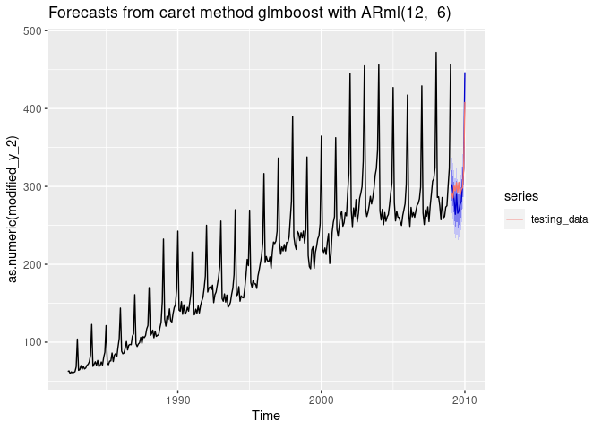
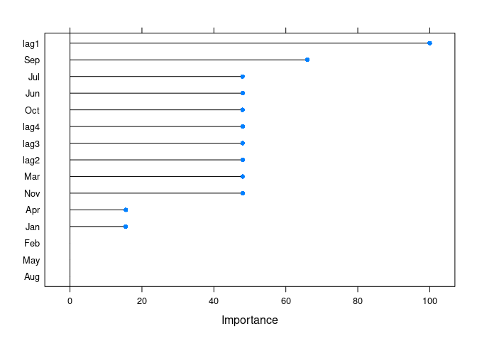

<!-- README.md is generated from README.Rmd. Please edit that file -->

# caretForecast

<!-- badges: start -->
<!-- badges: end -->

caretForecast aspires to equip users with the means of using machine
learning algorithms for time series data forecasting.

## Installation

The CRAN version with:

``` r
install.packages("caretForecast")
```

The development version from [GitHub](https://github.com/) with:

``` r
# install.packages("devtools")
devtools::install_github("Akai01/caretForecast")
```

## Example

By using caretForecast, users can train any regression model that is
compatible with the caret package. This allows them to use any machine
learning model they need in order to solve specific problems, as shown
by the examples below.

### Load the library

``` r
library(caretForecast)
#> Registered S3 method overwritten by 'quantmod':
#>   method            from
#>   as.zoo.data.frame zoo

data(retail_wide, package = "caretForecast")
```

### Forecasting with glmboost

``` r
i <- 8

dtlist <- caretForecast::split_ts(retail_wide[,i], test_size = 12)

training_data <- dtlist$train

testing_data <- dtlist$test

fit <- ARml(training_data, max_lag = 12, caret_method = "glmboost", 
            verbose = FALSE)
#> initial_window = NULL. Setting initial_window = 301
#> Loading required package: ggplot2
#> Loading required package: lattice

forecast(fit, h = length(testing_data), level = c(80,95))-> fc

accuracy(fc, testing_data)
#>                        ME     RMSE      MAE       MPE     MAPE     MASE
#> Training set 1.899361e-14 16.55233 11.98019 -1.132477 6.137096 0.777379
#> Test set     7.472114e+00 21.68302 18.33423  2.780723 5.876433 1.189685
#>                   ACF1 Theil's U
#> Training set 0.6181425        NA
#> Test set     0.3849258 0.8078558


autoplot(fc) + 
  autolayer(testing_data, series = "testing_data")
```



### Forecasting with cubist regression

``` r
i <- 9

dtlist <- caretForecast::split_ts(retail_wide[,i], test_size = 12)

training_data <- dtlist$train

testing_data <- dtlist$test

fit <- ARml(training_data, max_lag = 12, caret_method = "cubist", 
            verbose = FALSE)
#> initial_window = NULL. Setting initial_window = 301

forecast(fit, h = length(testing_data), level = c(80,95), PI = TRUE)-> fc

accuracy(fc, testing_data)
#>                       ME     RMSE      MAE        MPE     MAPE      MASE
#> Training set   0.5498926 13.33516 10.36501  0.0394589 2.223005 0.3454108
#> Test set     -17.9231242 47.13871 32.03537 -2.6737257 4.271373 1.0675691
#>                   ACF1 Theil's U
#> Training set 0.3979153        NA
#> Test set     0.4934659 0.4736043

autoplot(fc) + 
  autolayer(testing_data, series = "testing_data")
```


### Forecasting using Support Vector Machines with Linear Kernel

``` r

i <- 9

dtlist <- caretForecast::split_ts(retail_wide[,i], test_size = 12)

training_data <- dtlist$train

testing_data <- dtlist$test

fit <- ARml(training_data, max_lag = 12, caret_method = "svmLinear2", 
            verbose = FALSE, pre_process = c("scale", "center"))
#> initial_window = NULL. Setting initial_window = 301

forecast(fit, h = length(testing_data), level = c(80,95), PI = TRUE)-> fc

accuracy(fc, testing_data)
#>                      ME     RMSE      MAE        MPE     MAPE      MASE
#> Training set -0.2227708 22.66741 17.16009 -0.2476916 3.712496 0.5718548
#> Test set     -1.4732653 28.47932 22.92438 -0.4787467 2.883937 0.7639481
#>                   ACF1 Theil's U
#> Training set 0.3290937        NA
#> Test set     0.3863955 0.3137822

autoplot(fc) + 
  autolayer(testing_data, series = "testing_data")
```


``` r

get_var_imp(fc)
```


``` r

get_var_imp(fc, plot = F)
#> loess r-squared variable importance
#> 
#>   only 20 most important variables shown (out of 23)
#> 
#>        Overall
#> lag12 100.0000
#> lag1   83.9153
#> lag11  80.4644
#> lag2   79.9170
#> lag3   79.5019
#> lag4   78.3472
#> lag9   78.1634
#> lag5   78.0262
#> lag7   77.9153
#> lag8   76.7721
#> lag10  76.4275
#> lag6   75.7056
#> S1-12   3.8169
#> S3-12   2.4230
#> C2-12   2.1863
#> S5-12   2.1154
#> C4-12   1.9426
#> C1-12   0.5974
#> C6-12   0.3883
#> S2-12   0.2220
```

### Forecasting using Ridge Regression

``` r

i <- 8

dtlist <- caretForecast::split_ts(retail_wide[,i], test_size = 12)

training_data <- dtlist$train

testing_data <- dtlist$test

fit <- ARml(training_data, max_lag = 12, caret_method = "ridge", 
            verbose = FALSE)
#> initial_window = NULL. Setting initial_window = 301

forecast(fit, h = length(testing_data), level = c(80,95), PI = TRUE)-> fc

accuracy(fc, testing_data)
#>                       ME     RMSE      MAE        MPE     MAPE      MASE
#> Training set 7.11464e-14 12.69082  9.53269 -0.1991292 5.212444 0.6185639
#> Test set     1.52445e+00 14.45469 12.04357  0.6431543 3.880894 0.7814914
#>                   ACF1 Theil's U
#> Training set 0.2598784        NA
#> Test set     0.3463574 0.5056792

autoplot(fc) + 
  autolayer(testing_data, series = "testing_data")
```


``` r

get_var_imp(fc)
```


``` r

get_var_imp(fc, plot = F)
#> loess r-squared variable importance
#> 
#>   only 20 most important variables shown (out of 23)
#> 
#>        Overall
#> lag12 100.0000
#> lag1   84.2313
#> lag2   78.9566
#> lag11  78.5354
#> lag3   76.3480
#> lag10  74.4727
#> lag4   74.1330
#> lag7   74.0737
#> lag9   73.9113
#> lag5   73.2040
#> lag8   72.7224
#> lag6   71.5713
#> S1-12   6.3658
#> S3-12   2.7341
#> C2-12   2.7125
#> S5-12   2.4858
#> C4-12   2.2137
#> C6-12   0.6381
#> C1-12   0.5176
#> S2-12   0.4464
```

## Adding external variables

The xreg argument can be used for adding promotions, holidays, and other
external variables to the model. In the example below, we will add
seasonal dummies to the model. We set the ‘seasonal = FALSE’ to avoid
adding the Fourier series to the model together with seasonal dummies.

``` r

xreg_train <- forecast::seasonaldummy(AirPassengers)

newxreg <- forecast::seasonaldummy(AirPassengers, h = 21)

fit <- ARml(AirPassengers, max_lag = 4, caret_method = "cubist", 
            seasonal = FALSE, xreg = xreg_train, verbose = FALSE)
#> initial_window = NULL. Setting initial_window = 132

fc <- forecast(fit, h = 12, level = c(80, 95, 99), xreg = newxreg)

autoplot(fc)
```


``` r

get_var_imp(fc)
```



# Forecasting Hierarchical or grouped time series

``` r
library(hts)

data("htseg1", package = "hts")

fc <- forecast(htseg1, h = 4, FUN = caretForecast::ARml, 
               caret_method = "ridge", verbose = FALSE)

plot(fc)
```


